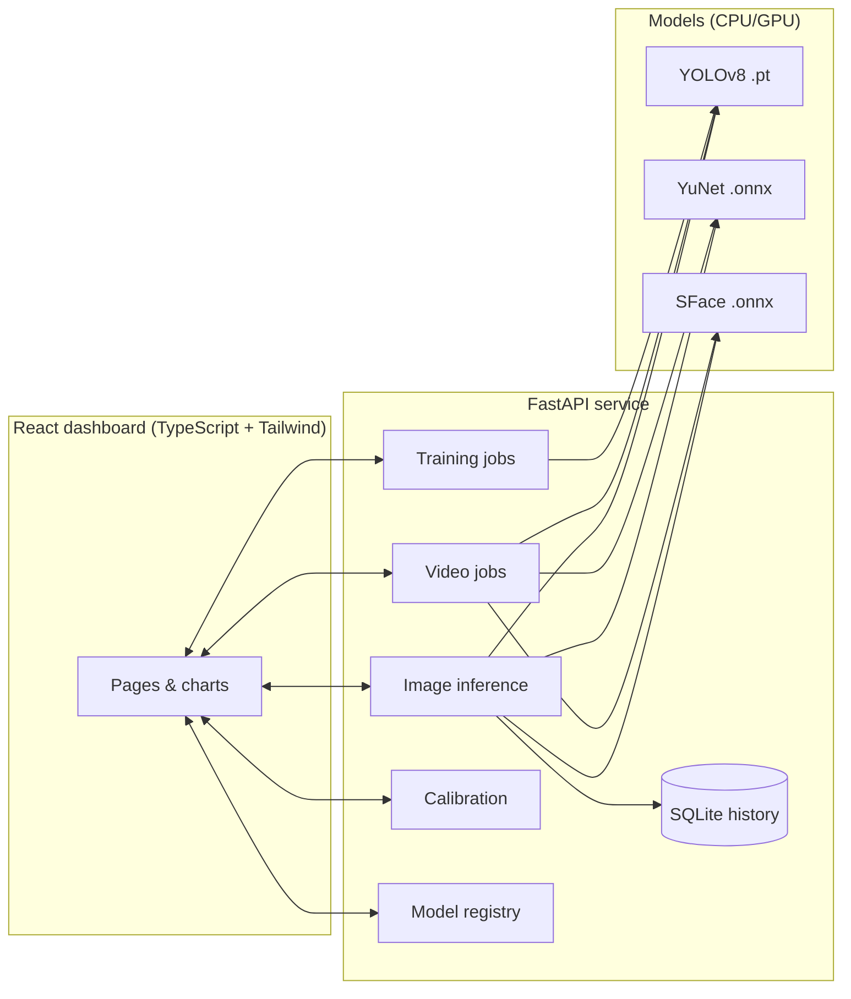

# VisionAI — Visual Intelligence Platform 🎯

A production-style **image-processing platform**: YOLOv8 **object detection**, YuNet + SFace
**face recognition**, **video analysis**, run **history**, gallery **calibration** and
**model fine-tuning** — behind one FastAPI service with a modern React dashboard.

Built as a serious image-processing project: real models, real metrics, reproducible
training, and one-command deployment.

---

## ✨ Capabilities

| Area | What you get |
|---|---|
| 📦 Object detection | YOLOv8 (80 COCO classes out of the box), tunable conf/IoU, switchable checkpoints |
| 🧑 Face recognition | YuNet detection + SFace embeddings, persistent gallery, cosine matching |
| 🎬 Video analysis | Background jobs, sampled-frame inference, annotated MP4 + timeline charts |
| 🧪 Fine-tuning | Train YOLO on your own dataset from the UI or CLI, auto-registered weights |
| 🎯 Calibration | Data-driven face-match threshold (FAR/FRR, ROC, max-margin suggestion) |
| 📊 Dashboard | Stats, latency trends, recent runs, model status |
| 🗂️ History | Every image run logged (SQLite) with thumbnails |
| 🐳 Deploy | Multi-stage Docker (React + FastAPI in one container), Compose, Render |

## 🖥️ The web app

| Page | Purpose |
|---|---|
| **Dashboard** | Totals, latency trend, runs-by-task, recent runs, model status |
| **Image Analysis** | Combined / objects / faces on uploads, annotated output + tables |
| **Video Analysis** | Upload video → live progress + logs → stats, charts, downloadable MP4 |
| **Face Gallery** | Enroll identities, per-identity quality, threshold calibration charts |
| **Fine-tune** | Dataset prep/validation, training jobs with live logs, model registry |
| **Run History** | Filterable log of all runs with previews |

## 🏗️ Architecture



**Key design decisions**
- Lazy singletons: weights load on first use; `/api/health` always answers.
- Graceful degradation: `/api/analyze` returns partial results + warnings if one branch is unavailable.
- Thread-safe inference under uvicorn; long tasks (video/training) run as tracked background jobs.
- Face pipeline: detect → alignCrop → embed → cosine-NN vs gallery, with calibrated threshold.

## 🚀 Quickstart

### Option A — Docker (recommended)

```bash
docker compose up --build
# → http://localhost:8000   (dashboard + API, weights auto-download)
```

### Option B — Local dev

```bash
# backend
pip install -r requirements.txt
python scripts/download_models.py
uvicorn app.main:app --host 0.0.0.0 --port 8000

# frontend (separate terminal)
cd frontend && npm install && npm run build   # output served by FastAPI at /
# ...or `npm run dev` for hot-reload (proxies /api to :8000)
```

Open the dashboard at **http://localhost:8000** and the interactive API at **/docs**.

## 🧑 Face recognition workflow

1. **Enroll** — Face Gallery page: 3–5 varied photos per person.
2. **Calibrate** — *Run calibration*: genuine vs impostor distributions, FAR/FRR curves,
   ROC, and a max-margin suggested threshold (needs 2+ identities × 2+ photos).
3. **Recognize** — Image/Video Analysis with the calibrated threshold.

## 🧪 Fine-tuning YOLO on your data

Full guide: **[docs/TRAINING.md](docs/TRAINING.md)**. The short version:

1. Prepare a dataset in YOLO format (`data.yaml` + `train|val/images|labels`).
2. Fine-tune page → validate the dataset → set epochs/imgsz/batch → start the job.
3. Watch live epoch logs; on completion `best.pt` is promoted to `models/` and appears
   in the registry — activate it with one click, download it, or keep iterating.

No dataset handy? *Generate demo dataset* builds a tiny synthetic 2-class set so you
can prove the loop works in under two minutes (verified: **mAP@0.5 = 0.995**).

```bash
# CLI equivalent
python -m training.train --data data/my_dataset/data.yaml --epochs 50 --name ppe_v1
```

## 📡 API reference

| Method & path | Purpose |
|---|---|
| `GET /api/health`, `GET /api/stats` | Liveness + dashboard roll-up |
| `POST /api/analyze` | Objects + faces in one call (logs to history) |
| `POST /api/detect/objects`, `POST /api/detect/faces`, `POST /api/recognize/faces` | Single-task inference |
| `GET/POST/DELETE /api/faces…`, `POST /api/faces/calibrate` | Gallery CRUD + calibration |
| `POST /api/video/analyze`, `GET /api/jobs…` | Video jobs, progress, logs, MP4 download |
| `GET/DELETE /api/history…` | Run log + thumbnails |
| `GET /api/models`, `POST /api/models/switch` | Registry + activation |
| `GET /api/training/status`, `POST /api/training/{demo-prepare,validate,start}` | Fine-tuning |

Uploads accept multipart `file` (images ≤ 10 MB, video ≤ 100 MB) or `image_base64`.

## ✅ Verified end-to-end (CPU, genuine weights)

| Check | Result |
|---|---|
| Face detect → enroll → recognize (same photo) | score **1.00, matched** |
| Perturbed copy (½ size, darker, blurred) | **0.909, matched** (thr 0.363) |
| Unknown person | detected → **"Unknown"** (0.13 < thr) |
| Non-face photo | 0 faces, no false positive |
| YOLOv8n objects (soccer photo) | ball **0.95**, person 0.85 + crowd |
| Video (795-frame traffic clip) | 80 frames, person/truck/car counts, annotated MP4 |
| Fine-tune (synthetic, 50 epochs, CPU) | **mAP@0.5 0.995**, P 0.93, R 0.91; weights promoted + served |
| Calibration (2 identities × 3 photos) | genuine μ 0.94 vs impostor μ 0.14 → suggested **0.534** |
| `pytest` | **14 passed** |
| React production build | ✅ served at `/` with client-route fallback |

## 🗂️ Repository layout

```
├── app/                    # FastAPI platform
│   ├── main.py             # routes: inference, video, history, calibration, registry, training + SPA
│   ├── config.py           # env-overridable settings
│   ├── detectors/          # YOLOv8 wrapper, YuNet+SFace engine
│   ├── services/           # inference, face_db, jobs, history, video, calibration, registry
│   ├── utils/              # image codec, annotation drawing
│   └── static/dist/        # React build output (generated, git-ignored)
├── frontend/               # React + TypeScript + Tailwind dashboard
│   └── src/{pages,components,lib}/
├── training/               # dataset utils, fine-tune runner (API + CLI)
├── scripts/                # download_models, register_faces, demo
├── tests/                  # pytest: API (mocked) + real service unit tests
├── docs/TRAINING.md        # fine-tuning playbook
├── Dockerfile              # multi-stage: node build → python runtime
└── docker-compose.yml / render.yaml / Makefile
```

## 🎛️ Configuration

| Var | Default | Meaning |
|---|---|---|
| `YOLO_MODEL_NAME` | `yolov8n.pt` | `s/m/l` = more accurate, slower |
| `YOLO_CONF` / `YOLO_IOU` | `0.25` / `0.45` | detection thresholds |
| `FACE_MATCH_THRESH` | `0.363` | SFace cosine default (calibrate to improve) |
| `MAX_FILE_MB` / `MAX_VIDEO_MB` | `10` / `100` | upload caps |
| `MAX_VIDEO_FRAMES` | `900` | analyzed-frame cap per video |
| `PORT` | `8000` | server port |

## 🧪 Tests & quality gates

```bash
pytest -q                       # backend (14 tests)
cd frontend && npm run build    # frontend production build must pass
```

## 🛠️ Troubleshooting

| Symptom | Fix |
|---|---|
| `Missing YuNet/SFace model` | `python scripts/download_models.py` (one-time, needs internet) |
| `/` shows "build the web app" | `cd frontend && npm install && npm run build` |
| `torch` install is huge | CPU-only first: `pip install torch --index-url https://download.pytorch.org/whl/cpu` |
| Slow first request | Normal — lazy model load; subsequent calls are fast |
| Training job fails on `polars` etc. | `pip install -r requirements.txt` (full, not `--no-deps`) |

## 📚 Report / viva talking points

- Two-stage face pipeline and why cosine-NN on SFace embeddings suits small galleries.
- YOLO single-shot vs two-stage detectors; mAP vs latency across n/s/m/l.
- Threshold tuning as a precision/recall trade-off — show the FAR/FRR + ROC charts.
- Transfer learning: fine-tuning from COCO weights converges in tens of epochs on small data.
- Deployment: ONNX + lazy singletons + background jobs + Docker = reproducible anywhere.

## 📄 License

MIT (see [LICENSE](LICENSE)). Model weights: YOLOv8 (AGPL-3.0, Ultralytics — research use),
YuNet/SFace (MIT, OpenCV Zoo). Sample photos: OpenCV sample set, for testing only.
